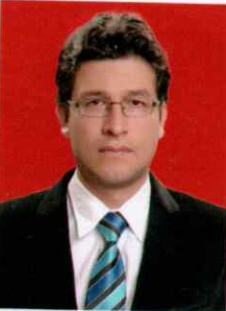

::: {.grid}

::: {.g-col-12 .g-col-md-4 style="text-align: center;"}
{fig-align="center" width="100px" style="border-radius: 8px; box-shadow: 0 4px 8px rgba(0,0,0,0.1); display: block; margin: 0 auto;"}
:::

::: {.g-col-12 .g-col-md-8}
## Datos Personales

* **Nombre Completo:** Luis Alberto Avila Borja
* **Cédula de Identidad:** 4630221 (Chuquisaca)
* **Edad:** 51 años
* **Nacionalidad:** Boliviana
* **Profesión:** Ingeniero Civil
* **Registro Profesional:** RNI 9080
:::

:::

---

## Perfil Profesional y Áreas de Especialización

Especialista en **modelación y gestión computacional acoplada hidrológica-hidrogeológica-geotécnica** con sólida base en Python, Inteligencia Artificial y Sistemas de Ingeniería 5.0. 

Posee amplia experiencia en la gestión, diseño, supervisión y evaluación de proyectos de recursos hídricos, infraestructura vial e ingeniería de presas, habiendo colaborado activamente en proyectos licitados por el Gobierno de Bolivia y financiados por organismos internacionales (Banco Mundial, Unión Europea, GTZ, UCEP Mi Riego, UCP PPCR).

### Competencias Técnicas Clave
* **Modelación Hidrológica e Hidrogeológica:** Modelación distribuida multidimensional con datos de sensores remotos y SIG. Manejo de variables forzantes de balances energéticos e hídricos distribuidos (*SolarFlux*, *ETR Priestley-Taylor Jet Propulsion*).
* **Software Hidrológico e Hidráulico:** WEAP, PT-Jet Propulsion, HEC-RAS, HEC-HMS, WaterCAD, Civil 3D.
* **Hidrogeología Numérica:** Flujo en medios porosos con Visual MODFLOW, AquiferTest y AQTESOLV.
* **Análisis Estructural y Geotécnico de Presas:** 
  * Análisis dinámico lineal y no lineal con interacción fluido-estructura-cimentación (reservorios compresibles e incompresibles).
  * Análisis de estabilidad y tensión-deformación con Elementos Finitos (FEM) y Equilibrio Límite usando **PLAXIS** y **GeoStudio** (*QUAKE/W*, *SLOPE/W*, *SIGMA/W*).
  * Diseños bajo normas AASHTO-LRFD y SAP2000 avanzado.
* **Docencia Universitaria:** Profesor de posgrado en el Método de Elementos Finitos (FEM) y modelación numérica (EBP-Univ. José Ballivián, Univ. Juan Misael Saracho).

---

## 1. Formación Académica

| Período | Grado Académico / Titulación | Institución |
| :---: | :--- | :--- |
| **1994 – 1999** | **Licenciado en Ingeniería Civil** *(Título en Provisión Nacional)* | Universidad Mayor, Real y Pontificia de San Francisco Xavier de Chuquisaca |
| **2001 – 2005** | **Licenciado en Lenguas Modernas** *(Inglés y Alemán)* | Universidad Mayor, Real y Pontificia de San Francisco Xavier de Chuquisaca |
| **2010 – 2013** | **Magíster en Hidrogeología y Recursos Hídricos** | Universidad Mayor, Real y Pontificia de San Francisco Xavier de Chuquisaca |
| **2016** | **Diplomado en Educación Superior** | Universidad Nacional Siglo XX |
| **2023** | **Diplomado en Ingeniería de Presas** *(Titulación en proceso)* | Universidad Nacional Siglo XX |
| **2024** | **Diplomado en Ingeniería Estructural** *(Titulación en proceso)* | Universidad Nacional Siglo XX |

---

## 2. Cursos de Especialización y Actualización

| Período | Curso / Programa de Capacitación | Institución | Carga Horaria |
| :---: | :--- | :--- | :---: |
| **04/2008** | ArcGIS | Instituto CIBERTEC | 20 hrs |
| **06/2008** | ArcView | Instituto CIBERTEC | 20 hrs |
| **09/2009 – 12/2009** | Hidrogeología física, flujo en medios porosos y modelaje de flujo de agua | University of Waterloo | 100 hrs |
| **09/2010** | ArcGIS Desktop 2 | Geosystems | 24 hrs |
| **03/2011** | Seminario internacional de mantenimiento sostenible de caminos rurales | Sociedad de Ingenieros de Bolivia | 20 hrs |
| **08/2011 – 09/2011** | Diseño de puentes con aplicación de la norma AASHTO-LRFD 2007 | Colegio de Ingenieros Civiles Ch. | 20 hrs |
| **12/2011** | Aplicación y manejo de equipos geodésicos GPS | COLQUEVIA S.R.L. | 30 hrs |
| **08/2012** | 2das Jornadas Internacionales del Cemento y el Hormigón | Instituto Boliviano del Cemento y Hormigón | 30 hrs |
| **08/2018** | Estructura y gestión de los proyectos de riego | CICCH - GADCH - Eduardo Consultora | 16 hrs |
| **08/2018** | Análisis y diseño de obras hidráulicas de captación para riego y abastecimiento | CICCH - GADCH - Eduardo Consultora | 20 hrs |
| **10/2018** | AutoCAD 3D | Instituto CIBERTEC | 30 hrs |
| **10/2018** | Modelación de presas de materiales sueltos | CICCH - GADCH - Eduardo Consultora | 20 hrs |
| **10/2018 – 11/2018** | WaterCAD | Instituto CIBERTEC | 30 hrs |
| **11/2018** | Procesamiento SIG aplicado al análisis de riesgo y resiliencia climática de proyectos de riego | CICCH - GADCH - Eduardo Consultora | 20 hrs |
| **08/2018 – 11/2018** | Programa de formación y alta especialidad en riego y Recursos Hídricos | CICCH - GADCH - Eduardo Consultora | 160 hrs |
| **01/2019** | SAP 2000 Avanzado | Instituto CIBERTEC | 30 hrs |
| **01/2019 – 02/2019** | AutoCAD Civil 3D | Instituto CIBERTEC | 30 hrs |
| **01/2019** | Diseño de riego tecnificado en sistemas colectivos | CICCH - GADCH - Eduardo Consultora | 20 hrs |
| **05/2019** | Aplicación de drones y aerofotogrametría a proyectos de riego y recursos hídricos | CICCH - GADCH - Eduardo Consultora | 25 hrs |
| **06/2019** | Simulación y operación de embalses en escenarios de cambio climático | CICCH - GADCH - Eduardo Consultora | 20 hrs |
| **07/2019** | Aplicación de Civil 3D al diseño y construcción de proyectos de riego | CICCH - GADCH - Eduardo Consultora | 25 hrs |
| **08/2019** | Diseño estructural de presas de gravedad con aplicación de planillas Excel | CICCH - GADCH - Eduardo Consultora | 25 hrs |



## 3. Experiencia Profesional

```{python}
#| label: tbl-experiencia
#| tbl-cap: "Registro General de Experiencia Profesional y Consultorías"
#| tbl-colwidths: [7, 18, 33, 15, 17, 10]
#| echo: false
#| message: false
#| warning: false

import pandas as pd
from IPython.display import Markdown

# Creación del DataFrame de Experiencia Profesional
data_exp = [
    [1, "Consultora CONASING para FDC", "Estudio a diseño final 'Puente vehicular Azero Norte'", "10.000", "Consultor en hidrología e hidráulica", "05/1999 - 08/1999"],
    [2, "Consultora CONASING para FDC", "Estudio a diseño final 'Puente vehicular Villa Charcas'", "10.000", "Consultor en hidrología e hidráulica", "09/1999 - 01/2000"],
    [3, "VPEPR - Banco Mundial", "Asistencia Técnica en Proyectos", "40.000", "Consultor en Proyectos y Medio Ambiente", "07/2000 - 12/2000"],
    [4, "Gobierno Autónomo Municipal Sucre", "Conservación de suelos 'Gaviones Los Tarcos', Saneamiento de quebradas y Rehabilitación Colector Villa Rosario", "83.200", "Proyectista Unidad de Estudios y Proyectos", "01/2001 - 12/2002"],
    [5, "FNDR Consultora J.V", "Supervisión construcción 'Mercado central y Alojamiento Padilla'", "1.280.000", "Residente de Supervisión", "07/2005 - 12/2006"],
    [6, "Unión Europea / Consultora J.V.", "Supervisión Planta de tratamiento y refacción de canal de riego Sotomayor", "2.780.000", "Residente de Supervisión", "07/2006 - 01/2008"],
    [7, "GTZ - Programa GESPRO", "Sistemas de riego Cantar Gallo, Pajcha y obras de alcantarillado/caminos", "7.000", "Asesor técnico", "03/2007 - 08/2007"],
    [8, "GTZ - Programa GESPRO", "Supervisión Paso a desnivel Bifurcación J. Mendoza", "2.000.000", "Residente de Supervisión", "03/2008 - 12/2008"],
    [9, "MOPVS - UECID", "Fiscalización a la construcción del Polideportivo, Piscina y Poligimnasio Olímpicos", "124.000.000", "Fiscal de Estructuras", "10/2008 - 03/2009"],
    [10, "Concejo Agropecuario Deptal.", "Peritaje técnico Proyecto Tinglado Mercado Campesino de Sucre", "9.000", "Perito", "04/2009 - 06/2009"],
    [11, "GADCH - SEDCAM CH", "Jefatura Unidad Estudios y Proyectos", "575.400", "Jefe Unidad de E. y Proyectos", "07/2009 - 04/2016"],
    [12, "GADCH - SEDCAM CH", "Estudio a Diseño final Técnico – Ambiental proyecto Alcantari Puente Méndez", "140.000", "Gerente del equipo de diseño", "02/2011 - 08/2011"],
    [13, "SEDCAM CH", "Construcción camino Alcantari Puente Méndez", "15.727.067", "Superintendente encargado de Proyecto", "02/2011 - 12/2013"],
    [14, "SEDCAM CH", "Mejoramiento camino Cr. Yapucaiti - Uruguay - San Juan del Pirai", "15.959.821", "Superintendente encargado de Proyecto", "07/2010 - 12/2013"],
    [15, "SEDCAM CH", "Programa Mantenimiento y Mejoramiento vial zona norte Chuquisaca", "6.720.000", "Superintendente Encargado", "01/2014 - 12/2014"],
    [16, "SEDCAM CH", "Programa Mantenimiento y Mejoramiento vial zona norte Chuquisaca", "8.561.445", "Superintendente Encargado", "01/2015 - 04/2016"],
    [17, "GAM Sucre", "Mejoramiento Av. Marcelo Quiroga Santa Cruz", "35.755.385", "Supervisor Obras de impacto", "07/2016 - 11/2016"],
    [18, "GAM Sucre", "Ampliación Av. Juana Azurduy de Padilla", "87.721.542", "Supervisor Obras de impacto", "07/2016 - 11/2016"],
    [19, "GADCH - Consultora AAIPA", "Construcción Represa El Tranque Grande de Culpina (EDTPI)", "1.202.337", "Gerente EDTPI / Esp. Hidráulico Hidrólogo", "01/2017 - 12/2017"],
    [20, "GAM Sucre", "Contrato Empréstito ISSA CONCRETEC (Infraestructura vial)", "5.000.000", "Supervisor externo de obras", "08/2017 - 12/2017"],
    [21, "Empresa ARVA", "Construcción obras hidráulicas MIC Sauce Zapallar", "1.284.844", "Director de obra", "01/2018 - 09/2018"],
    [22, "Empresa Consultora DESMA", "Rediseño presas Khota Pata, Tomoroco y Camatindi", "390.000", "Especialista en hidráulica y presas", "11/2018 - 05/2019"],
    [23, "Consultora Saavedra Vargas / UCEP Mi Riego", "Construcción presa Unala – Jatun Era (Estudio TESA)", "345.000", "Especialista Hidráulico Hidrólogo", "05/2019 - 11/2019"],
    [24, "DESMA / UCEP Mi Riego / CFA 9759", "Construcción Presa y sistema de riego Thinkusiri", "1.370.000", "Especialista Hidráulico Hidrólogo", "04/2019 - 03/2020"],
    [25, "Empresa ARVA", "Ampliación obras civiles Aeropuerto Jorge Henrich Arauz (Trinidad)", "12.506.824", "Especialista hidráulico-sanitario", "10/2019 - 05/2021"],
    [26, "Empresa Luis Heredia", "EDTPI 'Construcción Presa Quebrada Onda'", "550.000", "Especialista en hidráulica de presas", "11/2021 - 10/2022"],
    [27, "Empresa DESMA", "Manejo Integral de las cuencas Charaña, Sehuenca y Pallina", "600.000", "Especialista en hidrología e hidráulica", "03/2022 - 05/2022"],
    [28, "Empresa DESMA", "Plan de Aprovechamiento Hídrico Local (PAHL) subcuenca río Juchuy Jahuira", "500.000", "Especialista en hidrología y SIG", "12/2022 - 07/2023"],
    [29, "Consultora CCOAS / UCEP Mi Riego", "EDTPI: 'Construcción de Sistema De Riego y Presa El Cajón (Tarija)'", "600.000", "Especialista en hidrología e hidráulica de presas", "01/2023 - 08/2023"],
    [30, "Empresa DESMA / UCEP Mi Riego", "EDTPI 'Construcción Presa Y Sistema De Riego Tecnificado El Molino – Camargo'", "550.000", "Especialista en hidrología e hidráulica de presas", "06/2023 - 03/2024"],
    [31, "DESMA SRL / UCP PPCR", "EDTPI 'Construcción Presa y Sistema de Riego Pinaya'", "732.506", "Especialista en hidrología e hidráulica de presas", "05/2023 - 02/2024"],
    [32, "DESMA SRL / UCP PPCR", "EDTPI 'Construcción Presa y Sistema de Riego Central Agraria Cayimbaya'", "779.612", "Especialista en hidrología e hidráulica de presas", "05/2023 - 02/2024"],
    [33, "Asoc. Accidental D y D / GAM San Julián", "Estudio de Ampliación Implementación Sistema de Drenaje – San Julián", "700.000", "Especialista en hidrología e hidráulica", "04/2024 - 06/2025"],
    [34, "Empresa DESMA / UCEP Mi Riego", "EDTPI 'Construcción Represa y Sistema de Riego Sub Central Challhuani (Pojo)'", "2.000.000", "Especialista en hidrología e hidráulica de presas", "05/2024 - 06/2025"],
    [35, "UCP-PAAP", "Evaluación Técnica a las obras ejecutadas en la PTAR 'Agua potable y alcantarillado Cobija'", "211.040", "Especialista en Hidrogeología, Hidrogeoquímica e hidráulica", "07/2026 - 09/2026"]
]

df = pd.DataFrame(data_exp, columns=["N°", "Entidad / Empresa", "Objeto del Contrato / Proyecto", "Monto (Bs.)", "Cargo", "Período"])

# Generar la tabla en Markdown para Quarto
Markdown(df.to_markdown(index=False))
```


::: {.text-center style="margin-top: 40px;"}
**Ing. Luis Alberto Avila Borja**  
*Registro Nacional de Ingeniería: 9080*
:::